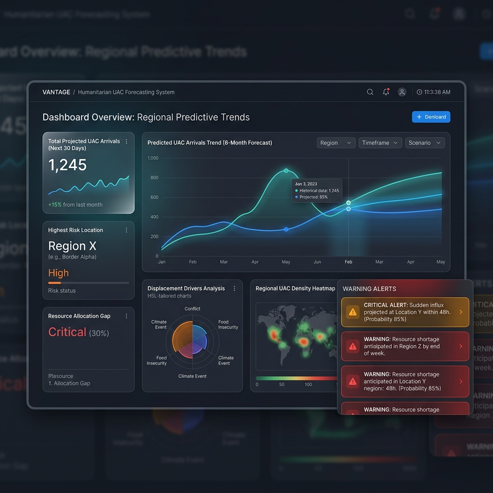

# Vantage: Predictive Capacity & Resource Forecasting

**Vantage** is an AI-driven forecasting engine designed to transform humanitarian logistical planning. By transitioning from reactive crisis management to proactive predictive intelligence, this project helps ensure resource stability in high-uncertainty environments like the UAC program.

## Project Vision
Manual planning in humanitarian systems often leads to operational bottlenecks. Vantage provides:
- **Predictive Foresight:** Forecasting care loads with 14-day lead times.
- **Early-Warning Intelligence:** Automated alerts for capacity breaches (when occupancy trends toward the 85% threshold).
- **Operational Clarity:** "What-if" scenario planning to visualize the impact of policy and inflow shifts.

## Tech Stack
- **Data Engineering:** Python (Pandas/NumPy) – Handling temporal gaps and feature engineering.
- **Forecasting Models:** SARIMA (Statistical), Random Forest (Machine Learning), and XGBoost (Machine Learning).
- **Dashboarding:** Streamlit – Building a real-time, responsive operational interface.
- **Validation:** Walk-Forward Cross-Validation to ensure forecast reliability over time.

---
*Built as a self-learning initiative to bridge the gap between Data Science and Humanitarian Operations.*

---

## 🌟 Visual Mockup of the UI
Below is a premium design representation of the Vantage Predictive Analytics Dashboard:



---

## 🚀 Key Features

1. **Robust Data Pipeline & Quality Control (`data_processing.py`)**
   - Automatically cleans, normalizes, and maps complex raw schemas into standardized operational variables (Inflow, Outflow, Occupancy, Capacity).
   - Resolves time-series gaps and missing values using time-based linear interpolation.
   - Computes advanced feature vectors including calendar features, multi-day lag indicators ($t-1$, $t-7$, $t-14$), and 7-day rolling averages.
   - Prevents data leakage by shifting target-dependent rolling features by 1 day.

2. **Recursive ML Forecasting Engine (`modeling.py`)**
   - Implements baseline statistical (Naive Persistence, SARIMA) and machine learning (Random Forest, XGBoost) models.
   - Features a custom recursive forecasting engine that projects occupancy 30 days into the future.
   - Evaluates models using a rolling expanding-window **Walk-Forward Validation** harness to measure real-world performance.
   - Trains a specialized discharge predictor to support the feedback loops in the simulation engine.

3. **Interactive Control Center (`app.py`)**
   - **Executive Dashboard**: KPI metrics (net pressure, utilization rates) and interactive forecasting charts with confidence interval shading.
   - **Early Warning System**: Automatic alert triggers and calendar view schedules recommending when to activate emergency standby staffing.
   - **Sandbox Simulation (What-If)**: A playground to model how a border apprehension surge propagates through the network, dynamically forecasting peak occupancy and capacity breach days.
   - **Explainability & AI Governance**: Visualizes Gini importance and breaks down SHAP (SHapley Additive exPlanations) decision drivers.

---

## 📂 Project Structure

```
Vantage/
├── .streamlit/
│   └── config.toml               # Streamlit styling & cloud deployment configurations
├── data/
│   ├── HHS_Cleaned_Data.csv      # Raw HHS dataset
│   └── mock_uac_data.csv         # Synthetic dataset for fallback testing
├── api/
│   └── index.py                  # Optional: Serverless FastAPI backend entry point
├── app.py                         # Streamlit command center UI
├── data_processing.py             # Data engineering & feature creation pipeline
├── modeling.py                    # Forecast model definitions & validation harness
├── generate_mock_data.py          # Synthetic dataset generator
├── requirements.txt               # System package dependencies
├── vercel.json                    # Optional: Vercel routing rules
└── README.md                      # Documentation & user guide
```

---

## 📊 Walk-Forward Benchmarking Results

Models were evaluated on a rolling 90-day holdout validation split on the actual `HHS_Cleaned_Data.csv` (1,075 days of daily observations):

| Model | Mean Absolute Error (MAE) | Root Mean Squared Error (RMSE) | Mean Absolute Percentage Error (MAPE) | Operational Rank |
| :--- | :---: | :---: | :---: | :---: |
| **SARIMA (Statistical)** | **25.67 beds** | **29.42 beds** | **1.10%** | 🏆 **#1 (Highest Accuracy)** |
| **Random Forest (ML)** | **27.85 beds** | **33.59 beds** | **1.21%** | 🥈 **#2 (Robust ML)** |
| **XGBoost (ML)** | **48.64 beds** | **58.48 beds** | **2.07%** | 🥉 **#3 (Inflow Interactions)** |
| Naive Persistence (Baseline) | 54.96 beds | 64.80 beds | 2.35% | ❌ #4 (Benchmark Baseline) |

*Note: While SARIMA delivers the highest baseline accuracy on historical seasonal trends, the Machine Learning models (Random Forest/XGBoost) are essential because they model multi-variable feedback loops (Intake ➔ Discharges), enabling interactive surge simulations.*

---

## ⚙️ Installation & Getting Started

### 1. Install Dependencies
Ensure you have Python 3.8+ installed, then run:
```bash
pip install -r requirements.txt
```

### 2. Verify Modeling Pipeline
To run the Walk-Forward Validation benchmark directly in the terminal:
```bash
python modeling.py
```

### 3. Launch the Streamlit Dashboard
Launch the dashboard on localhost:
```bash
streamlit run app.py
```
This will automatically launch the browser at `http://localhost:8501`.

---

## ⚖️ Model Governance & Explainability

- **Auto-Regressive Signal (`Occupancy_Lag_1`)**: Anchors predictions by reflecting slow, incremental shifts in bed occupancy.
- **Administrative Seasonality (`Intake_Lag_7` / `Discharges_Lag_7`)**: Captures weekly cycles of lower weekend intakes and administrative releases.
- **Leading Indicator (`CBP_Occupancy_Lag_1`)**: Tracks border backlogs of children in CBP custody, serving as a 1-3 day leading indicator of future HHS intakes.
- **Net System Pressure**: Computes daily intake minus discharge rates to capture whether inflow surges or discharge bottlenecks are accelerating capacity depletion.

---

## ☁️ Deployment Guide

Streamlit is a stateful framework that uses persistent WebSockets for client-server communication. Below are the recommended pathways for deploying the Vantage platform.

### 🏆 1. Streamlit Community Cloud (Recommended & Free)
The easiest way to deploy the dashboard is through Streamlit's official cloud service:
1. Push the code to your GitHub repository.
2. Sign in to [Streamlit Community Cloud](https://share.streamlit.io/).
3. Click **"New app"**, select your repository, branch (`main`), and main file path (`app.py`).
4. Click **"Deploy"**. The app will be live and automatically redeploy on every git push!

### 🤖 2. Hugging Face Spaces (Free ML Hosting)
Ideal for machine learning dashboards:
1. Create a new Space on [Hugging Face Spaces](https://huggingface.co/spaces).
2. Choose **Streamlit** as the SDK.
3. Commit and push the repository files directly to the Space's Git remote.

### ⚡ 3. Vercel Serverless Deployment (Architectural Notes)
Vercel is designed for **stateless serverless functions** (e.g., Next.js, static HTML, frontend assets) and has a strict serverless execution timeout cap (10s to 60s). It **does not natively support long-running stateful WebSocket servers** like Streamlit out of the box. 

If you wish to deploy the system to Vercel, the industry-standard architecture is a **decoupled design**:
1. **Frontend**: Build a React or Next.js user interface hosted on Vercel.
2. **Backend**: Host the model prediction pipeline as a stateless API. Vercel supports Python serverless functions (e.g., using **FastAPI** or **Flask**).

#### Decoupled FastAPI Serverless Endpoint on Vercel
To serve predictions on Vercel, create an `api/index.py` file:
```python
from fastapi import FastAPI
import pandas as pd
from modeling import MachineLearningForecaster
# Import models and pipelines here...

app = FastAPI()

@app.get("/api/predict")
def predict_occupancy(days: int = 30):
    # Call recursive forecast engine from modeling.py
    # return predictions as JSON
    return {"predictions": [12450.5, 12480.2, ...]}
```

Add a `vercel.json` routing configuration in the root directory:
```json
{
  "rewrites": [
    {
      "source": "/api/(.*)",
      "destination": "api/index.py"
    }
  ]
}
```
This file routing forwards incoming `/api/*` web requests to your serverless Python code on Vercel.
